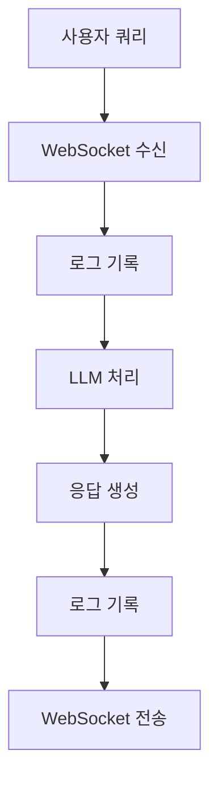

# 챗봇 로깅 시스템 문서

## 1. 시스템 개요

### 1.1 목적

- 챗봇 대화 내용의 체계적인 기록
- 사용자별 대화 이력 추적
- 시스템 오류 및 예외 상황 모니터링
- 성능 및 사용성 분석

### 1.2 주요 기능

- 실시간 대화 로깅
- 사용자별 로그 분리
- 에러 추적 및 모니터링
- 로그 파일 자동 관리

## 2. 시스템 구조

### 2.1 파일 구조

```
logs/
├── chat_YYYY-MM-DD.log    # 일반 채팅 로그
└── error_YYYY-MM-DD.log   # 에러 로그
```

### 2.2 클래스 구조

```python
ChatLogger
├── __init__(user_id)
├── log_chat(message, level)
├── log_error(message, exc_info)
├── log_query(query)
├── log_response(response)
└── log_context(context)
```

## 3. 로깅 파이프라인

### 3.1 메시지 흐름



### 3.2 로그 레벨

- INFO: 일반적인 채팅 메시지
- DEBUG: 상세한 컨텍스트 정보
- WARNING: 연결 해제 등 경고
- ERROR: 오류 발생

## 4. 구현 상세

### 4.1 로그 포맷

```python
# 채팅 로그
%(asctime)s - %(levelname)s - [User: %(user_id)s] - %(message)s

# 에러 로그
%(asctime)s - %(levelname)s - [User: %(user_id)s] - %(message)s\n%(pathname)s:%(lineno)d
```

### 4.2 주요 로깅 포인트

1. 사용자 연결/해제
2. 쿼리 수신
3. LLM 처리 시작/완료
4. 응답 생성
5. 오류 발생

## 5. 사용 예시

### 5.1 기본 사용

```python
logger = ChatLogger("user_123")
logger.log_query("안녕하세요")
logger.log_response("안녕하세요! 무엇을 도와드릴까요?")
```

### 5.2 에러 처리

```python
try:
    # 처리 로직
except Exception as e:
    logger.log_error("처리 중 오류 발생", exc_info=True)
```

## 6. 모니터링 및 분석

### 6.1 로그 확인

```bash
# 실시간 로그 모니터링
tail -f logs/chat_2024-03-20.log

# 에러 로그 확인
tail -f logs/error_2024-03-20.log
```

### 6.2 분석 가능한 지표

- 사용자별 대화 빈도
- 응답 생성 시간
- 오류 발생 패턴
- 컨텍스트 사용 빈도

## 7. 유지보수

### 7.1 로그 로테이션

- 최대 파일 크기: 10MB
- 백업 파일 수: 5개
- 날짜별 자동 생성

### 7.2 주의사항

- 민감 정보 로깅 금지
- 로그 파일 권한 관리
- 디스크 공간 모니터링

## 8. 향후 개선 사항

- [ ] 로그 분석 대시보드 구현
- [ ] 실시간 알림 시스템 연동
- [ ] 로그 압축 및 아카이빙
- [ ] 성능 메트릭 추가

## 9. 변경 이력

### v1.0.0 (2024-03-20)

- 초기 로깅 시스템 구현
- 기본 채팅 로깅 기능
- 에러 로깅 기능
- 로그 로테이션 구현
